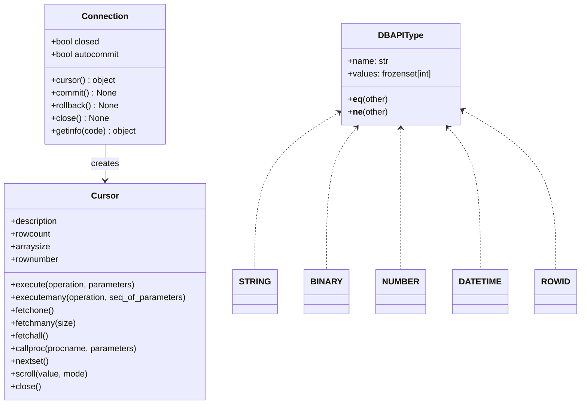

# API Reference

This reference documents the exported DB-API 2.0 surface in `pytibero`.

## Module-level API (`pytibero`)

### Constants

| Name | Value | Notes |
|---|---|---|
| `apilevel` | `"2.0"` | DB-API version marker |
| `threadsafety` | `1` | Threads may share the module, not connections |
| `paramstyle` | `"qmark"` | SQL placeholders use `?` |

### `connect(...)`

```python
connect(
    host: str = "localhost",
    port: int = 8629,
    database: str = "",
    user: str = "tibero",
    password: str = "",
    dsn: str | None = None,
    driver: str = "Tibero 7 ODBC Driver",
    backend: str = "pyodbc",
    tbcli_library: str | None = None,
    autocommit: bool = False,
    login_timeout: int | None = None,
    **kwargs: object,
) -> Connection
```

Creates and returns a `Connection`.

| Parameter | Type | Default | Description |
|---|---|---|---|
| `host` | `str` | `"localhost"` | Server host for non-DSN mode |
| `port` | `int` | `8629` | Server port for non-DSN mode |
| `database` | `str` | `""` | Optional DB/service name |
| `user` | `str` | `"tibero"` | Login user |
| `password` | `str` | `""` | Login password |
| `dsn` | `str \| None` | `None` | DSN name; overrides driver/host/port path |
| `driver` | `str` | `"Tibero 7 ODBC Driver"` | ODBC driver name |
| `backend` | `str` | `"pyodbc"` | `pyodbc` or `tbcli` |
| `tbcli_library` | `str \| None` | `None` | Path hint for native `tbcli` library |
| `autocommit` | `bool` | `False` | Native connection autocommit |
| `login_timeout` | `int \| None` | `None` | Login timeout hint |
| `**kwargs` | `object` | n/a | Routed to native connect kwargs or ODBC options |

## `Connection` class

`Connection` wraps a native backend connection and manages cursor lifecycle and transaction control.

### Properties

| Property | Type | Description |
|---|---|---|
| `closed` | `bool` | `True` when connection is closed |
| `autocommit` | `bool` | Reads/sets native autocommit |
| `native_connection` | `object` | Underlying backend connection object |

### Methods

#### `execute(operation: str, parameters: object = None) -> object`
Creates a cursor and executes one statement in a single call.

| Parameter | Type | Description |
|---|---|---|
| `operation` | `str` | SQL text |
| `parameters` | `object` | Optional bind values |

#### `cursor() -> object`
Creates a new cursor bound to the connection.

- Returns `pytibero.cursor.Cursor` for `pyodbc`
- Returns native `TbcliCursor` for `tbcli`

#### `commit() -> None`
Commits current transaction.

#### `rollback() -> None`
Rolls back current transaction.

#### `close() -> None`
Closes tracked cursors, closes native connection, marks connection closed.

#### `getinfo(code: int) -> object`
Returns backend metadata from native `getinfo`.

| Parameter | Type | Description |
|---|---|---|
| `code` | `int` | Driver-specific info selector |

#### `setdecoding(*args, **kwargs) -> object`
Forwards to native connection method when available.

#### `setencoding(*args, **kwargs) -> object`
Forwards to native connection method when available.

#### `add_output_converter(*args, **kwargs) -> object`
Forwards to native connection method when available.

#### `clear_output_converters() -> object`
Forwards to native connection method when available.

#### `remove_output_converter(*args, **kwargs) -> object`
Forwards to native connection method when available.

### Context manager behavior

`with Connection(...) as conn:` commits on normal exit, rolls back on exception, then closes.

## `Cursor` class (`pytibero.cursor.Cursor`)

DB-API cursor wrapper used with `pyodbc` backend.

### Properties

| Property | Type | Description |
|---|---|---|
| `connection` | `object` | Owning `Connection` |
| `description` | `tuple[...] \| None` | Result metadata |
| `rowcount` | `int` | Rows affected (backend-provided) |
| `arraysize` | `int` | Default fetch size for `fetchmany` |
| `rownumber` | `int \| None` | Local cursor position tracker |
| `lastrowid` | `object \| None` | Native `lastrowid` when available |
| `native_cursor` | `object` | Underlying native cursor |

### Methods

#### `close() -> None`
Closes native cursor and detaches from connection tracking.

#### `execute(operation: str, parameters: Sequence[Any] | Mapping[str, Any] | None = None) -> Cursor`
Executes one statement. Mapping parameters are rejected for `qmark` style.

| Parameter | Type | Description |
|---|---|---|
| `operation` | `str` | SQL text with `?` placeholders |
| `parameters` | `Sequence \| Mapping \| None` | Bind values |

#### `executemany(operation: str, seq_of_parameters: Sequence[Sequence[Any] | Mapping[str, Any]]) -> Cursor`
Runs repeated execution for a sequence of parameter rows.

#### `fetchone() -> tuple[Any, ...] | None`
Fetches one row.

#### `fetchmany(size: int | None = None) -> list[tuple[Any, ...]]`
Fetches up to `size` rows (or `arraysize` when omitted).

#### `fetchall() -> list[tuple[Any, ...]]`
Fetches all remaining rows.

#### `setinputsizes(sizes: Any) -> None`
No-op placeholder for DB-API compatibility.

#### `setoutputsize(size: int, column: int | None = None) -> None`
No-op placeholder for DB-API compatibility.

#### `callproc(procname: str, parameters: Sequence[Any] = ()) -> Sequence[Any]`
Builds and executes `CALL procname(...)`.

#### `nextset() -> object | None`
Advances to next result set if backend supports it.

#### `scroll(value: int, mode: str = "relative") -> None`
Uses native cursor scrolling if available, else raises `NotSupportedError`.

### Iterator and context manager

- Iteration (`for row in cursor`) repeatedly calls `fetchone()`
- `with cursor:` closes cursor on exit

## Type constructors and type objects

### Constructor functions

| Function | Return type | Notes |
|---|---|---|
| `Date(year, month, day)` | `datetime.date` | Date constructor |
| `Time(hour, minute, second)` | `datetime.time` | Time constructor |
| `Timestamp(year, month, day, hour, minute, second)` | `datetime.datetime` | Datetime constructor |
| `DateFromTicks(ticks)` | `datetime.date` | From Unix ticks |
| `TimeFromTicks(ticks)` | `datetime.time` | From Unix ticks |
| `TimestampFromTicks(ticks)` | `datetime.datetime` | From Unix ticks |
| `Binary(value)` | `bytes` | Accepts `bytes`, `bytearray`, or `str` |

### `DBAPIType` objects

| Object | ODBC SQL type codes |
|---|---|
| `STRING` | `{1, 12}` (`SQL_CHAR`, `SQL_VARCHAR`) |
| `BINARY` | `{-2, -3, -4}` (`SQL_BINARY`, `SQL_VARBINARY`, `SQL_LONGVARBINARY`) |
| `NUMBER` | `{-5, 2, 3, 4, 5, 6, 7, 8}` (`SQL_BIGINT`, `SQL_NUMERIC`…`SQL_DOUBLE`) |
| `DATETIME` | `{91, 92, 93}` (`SQL_TYPE_DATE`, `SQL_TYPE_TIME`, `SQL_TYPE_TIMESTAMP`) |
| `ROWID` | `{15}` |

## Relationships


