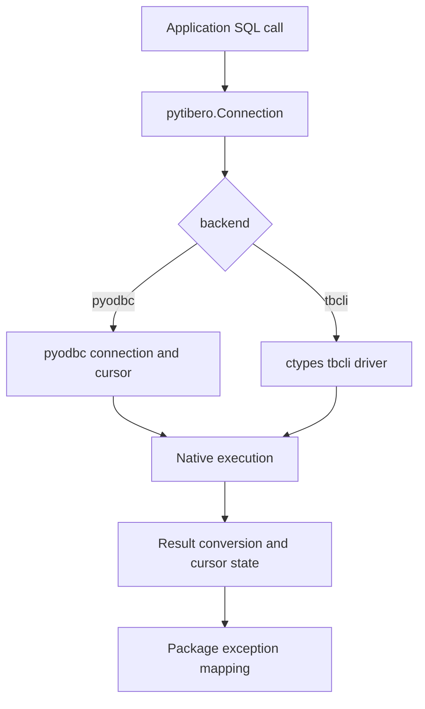
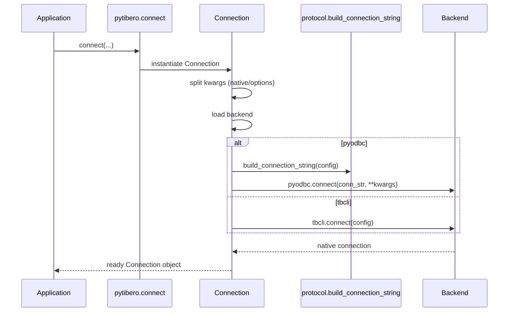

# Architecture

!!! info "Design target"
    Keep a stable DB-API surface while allowing backend implementation differences (`pyodbc` vs `tbcli`).

## Layers

1. Application code calls `pytibero.connect(...)`.
2. `pytibero.connection.Connection` selects a transport backend.
3. `pyodbc` or `tbcli` opens the real database connection.
4. `pytibero.cursor.Cursor` delegates execute and fetch operations to the native cursor for the `pyodbc` backend.
5. `pytibero.tbcli` provides a native Tibero client path for the `tbcli` backend.
6. Backend exceptions are mapped into package-owned DB-API exception classes.

## Design choices

- `qmark` parameter style matches `pyodbc` and DB-API 2.0 expectations.
- Package-owned exception classes keep the public API stable.
- Connection-string creation is isolated in `protocol.py` so backend behavior is testable.
- Common native `pyodbc` connect kwargs are separated from ODBC string attributes.
- The `tbcli` backend uses Tibero's native client library through `ctypes`.
- Cursor state tracks `rownumber` locally so DB-API iteration remains consistent.
- Unit tests use a fake `pyodbc` backend; e2e tests validate the real driver path.

## Runtime architecture map

## Connection construction sequence

!!! tip "Error portability"
    Application code should catch `pytibero` exceptions instead of backend-specific exception classes.
