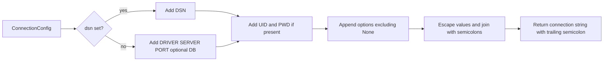

# Connection Guide

This guide documents connection behavior for both supported backends: `pyodbc` (default) and `tbcli`.

## ConnectionConfig fields

`pytibero.connect(...)` is normalized into `ConnectionConfig`.

| Field | Type | Default | Meaning |
|---|---|---|---|
| `host` | `str` | `"localhost"` | Tibero host when not using DSN |
| `port` | `int` | `8629` | Tibero port when not using DSN |
| `database` | `str` | `""` | Database/service name, emitted as `DB=` when set |
| `user` | `str` | `"tibero"` | Username, emitted as `UID=` when set |
| `password` | `str` | `""` | Password, emitted as `PWD=` when set |
| `dsn` | `str \| None` | `None` | DSN name; when set, driver/host/port path is skipped |
| `driver` | `str` | `"Tibero 7 ODBC Driver"` | ODBC driver name for non-DSN mode |
| `backend` | `str` | `"pyodbc"` | Backend selector: `pyodbc` or `tbcli` |
| `tbcli_library` | `str \| None` | `None` | Optional explicit path to `tbcli` shared library |
| `autocommit` | `bool` | `False` | Transaction mode applied on native connection |
| `login_timeout` | `int \| None` | `None` | Login timeout hint |
| `connect_kwargs` | `dict[str, object]` | `{}` | pyodbc-native kwargs routed to `pyodbc.connect` |
| `options` | `dict[str, object]` | `{}` | Extra attributes appended into the ODBC connection string |

## Backend selection and connection flow

```mermaid
flowchart TD
    A[pytibero.connect(...)] --> B[Connection.__init__]
    B --> C{backend.lower()}
    C -->|pyodbc| D[import pyodbc]
    C -->|tbcli| E[load_tbcli_driver]
    C -->|other| F[InterfaceError unsupported backend]
    D --> G[build_connection_string(config)]
    E --> H[tbcli connect(config)]
    G --> I[pyodbc.connect(conn_str, **connect_kwargs)]
    I --> J[Connection ready]
    H --> J
```

## DSN mode vs driver mode

### DSN mode (`dsn` provided)

- Connection string starts with `DSN=<dsn>`.
- `DRIVER`, `SERVER`, and `PORT` are not added.
- `UID` / `PWD` are still appended when provided.

### Driver mode (`dsn` omitted)

- Connection string includes:
  - `DRIVER=<driver>`
  - `SERVER=<host>`
  - `PORT=<port>`
  - optional `DB=<database>`
- Then appends `UID` / `PWD` and option attributes.

## Connection string assembly

`protocol.build_connection_string(config)` builds attributes in this order:

1. DSN or driver/server/port/database segment
2. Credentials (`UID`, `PWD`) when non-empty
3. Extra options from `config.options` (skips keys with `None` values)

Value formatting rules:

- Boolean option values become `1` / `0`
- Values containing `;`, `{`, `}`, spaces, or surrounding whitespace are brace-escaped
- `DRIVER` is always brace-escaped
- Final string is `;`-terminated



## Connection kwargs routing

Extra keyword arguments are split into two buckets:

### Routed to `pyodbc.connect(..., **kwargs)` as native kwargs

- `ansi`
- `attrs_before`
- `encoding`
- `readonly`
- `timeout`
- `unicode_results`

### Routed to ODBC string attributes (`options`)

All other extra kwargs (for example `ApplicationName="my-app"`) are appended to the connection string as key/value attributes.

Additionally:

- `autocommit` is always set explicitly in native connect kwargs for `pyodbc`
- If `login_timeout` is set and `timeout` was not explicitly supplied, `timeout=login_timeout` is injected

!!! tip "Choosing backend"
    Start with `pyodbc` for standard ODBC deployments. Use `tbcli` when you want direct native client control or cannot rely on `pyodbc` in your runtime.

!!! warning "Common connection errors"
    - `InterfaceError: pyodbc is required...` means `pyodbc` is missing in your environment.
    - `InterfaceError: tbcli library could not be loaded...` means the shared library path/discovery failed.
    - `InterfaceError: unsupported backend: ...` means `backend` is not `pyodbc` or `tbcli`.
