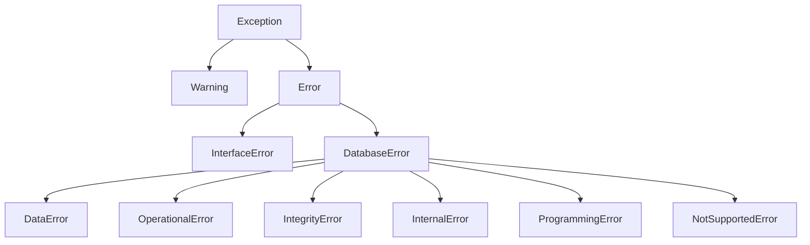

# Error Handling

`pytibero` provides package-owned PEP 249-compatible exceptions so application code can handle errors consistently across backends.

## Exception hierarchy



## Exception classes

| Class | Base | Typical usage |
|---|---|---|
| `Warning` | `Exception` | Important non-fatal warnings |
| `Error` | `Exception` | Root package error type |
| `InterfaceError` | `Error` | Client-side interface/configuration misuse |
| `DatabaseError` | `Error` | Database/backend failures with optional `errno` / `sqlstate` |
| `DataError` | `DatabaseError` | Data conversion or processed-data issues |
| `OperationalError` | `DatabaseError` | Runtime operational failures (connectivity, transport) |
| `IntegrityError` | `DatabaseError` | Constraint/integrity violations |
| `InternalError` | `DatabaseError` | Database internal error conditions |
| `ProgrammingError` | `DatabaseError` | Invalid SQL or DB-API usage |
| `NotSupportedError` | `DatabaseError` | Unsupported API feature or backend operation |

## Backend error mapping

### `pyodbc` backend

Native `pyodbc` exceptions are mapped to local exceptions by class name:

- `pyodbc.InterfaceError` -> `pytibero.InterfaceError`
- `pyodbc.DataError` -> `pytibero.DataError`
- `pyodbc.IntegrityError` -> `pytibero.IntegrityError`
- `pyodbc.InternalError` -> `pytibero.InternalError`
- `pyodbc.ProgrammingError` -> `pytibero.ProgrammingError`
- `pyodbc.NotSupportedError` -> `pytibero.NotSupportedError`
- `pyodbc.OperationalError` -> `pytibero.OperationalError`
- `pyodbc.DatabaseError` -> `pytibero.DatabaseError`
- `pyodbc.Error` -> `pytibero.Error`

`sqlstate` (5-char string) and native error numbers are extracted when available and attached to mapped exceptions.

### `tbcli` backend

The `tbcli` transport raises package exceptions directly (for example `OperationalError`, `ProgrammingError`, `DataError`, `InterfaceError`) based on return codes and conversion paths.

!!! tip "Always catch package exceptions"
    Catch `pytibero.Error` (or subclasses) rather than backend-specific exception classes to keep code portable between `pyodbc` and `tbcli`.

## Recommended patterns

### Generic DB-API error boundary

```python
import pytibero

try:
    with pytibero.connect(host="localhost", user="tibero", password="tmax") as conn:
        with conn.cursor() as cur:
            cur.execute("SELECT 1 FROM dual")
            print(cur.fetchall())
except pytibero.Error as exc:
    print(f"Database operation failed: {exc}")
```

### Handle specific categories

```python
import pytibero

try:
    conn = pytibero.connect(backend="tbcli", tbcli_library="/bad/path/libtbcli.so")
except pytibero.InterfaceError as exc:
    # Missing backend dependency, bad backend name, closed-connection access, etc.
    print(f"Configuration/interface issue: {exc}")
except pytibero.OperationalError as exc:
    # Network, connection establishment, runtime operational errors
    print(f"Operational failure: {exc}")
except pytibero.DatabaseError as exc:
    # Broad DB-side category, includes errno/sqlstate when available
    print(f"Database error: {exc}; errno={exc.errno}; sqlstate={exc.sqlstate}")
```

### Transaction-safe pattern

```python
import pytibero

conn = pytibero.connect(host="localhost", user="tibero", password="tmax")
try:
    cur = conn.cursor()
    cur.execute("UPDATE accounts SET balance = balance - ? WHERE id = ?", (10, 1))
    cur.execute("UPDATE accounts SET balance = balance + ? WHERE id = ?", (10, 2))
    conn.commit()
except pytibero.DatabaseError:
    conn.rollback()
    raise
finally:
    conn.close()
```
