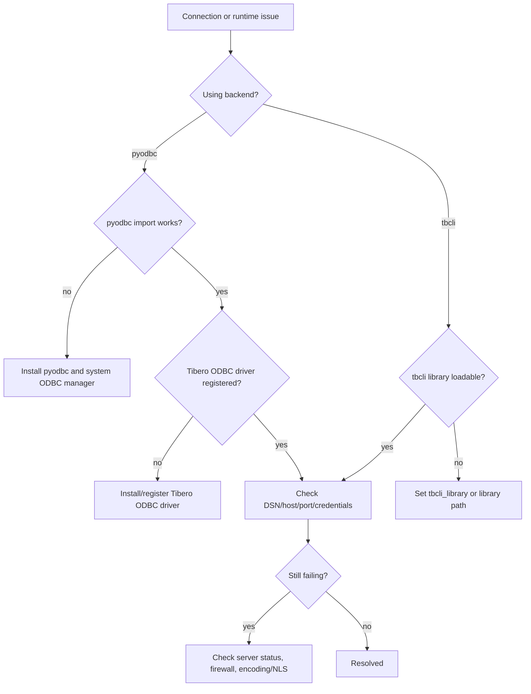

# FAQ

## Troubleshooting decision tree



??? question "pyodbc not found"
    **Symptom**
    - `InterfaceError: pyodbc is required to use pytibero...`

    **Fix**
    1. Install Python package:
       ```bash
       pip install pyodbc
       ```
    2. Ensure system ODBC manager is installed (for example unixODBC on Linux).
    3. Verify import in the target runtime environment:
       ```bash
       python -c "import pyodbc; print(pyodbc.version)"
       ```

??? question "Tibero ODBC driver not found"
    **Symptom**
    - Connection fails with driver/DSN resolution errors.

    **Fix**
    1. Install the Tibero ODBC driver package.
    2. Verify ODBC driver registration (commonly in `odbcinst.ini`).
    3. If using DSN mode, confirm DSN entry exists and points to the correct driver/server.
    4. If using driver mode, ensure `driver="Tibero 7 ODBC Driver"` matches installed driver name.

??? question "tbcli library not found"
    **Symptom**
    - `InterfaceError: tbcli library could not be loaded...`

    **Fix**
    1. Provide explicit `tbcli_library` path:
       ```python
       conn = pytibero.connect(backend="tbcli", tbcli_library="/opt/tibero7/client/lib/libtbcli.so")
       ```
    2. Or configure dynamic library search path (`LD_LIBRARY_PATH` on Linux).
    3. Confirm file permissions and architecture compatibility.

??? question "Connection refused or timeout"
    **Symptom**
    - Operational errors during connect.

    **Fix checklist**
    - Verify Tibero server process is running.
    - Confirm host and port (`8629` by default).
    - Check firewall/security group rules.
    - Validate credentials and database/service name.
    - Try `login_timeout` to fail faster and identify connectivity issues early.

??? question "Character encoding issues"
    **Symptom**
    - Garbled text, replacement characters, or decoding mismatches.

    **Fix**
    1. Align Tibero NLS/character-set settings between server and client environment.
    2. For `pyodbc`, consider explicit connect kwargs like `encoding` / `unicode_results`.
    3. Verify application assumes UTF-8 where appropriate.
    4. Test round-trip insert/select for multilingual strings.

## Additional checks

- Use [Connection Guide](connection.md) to verify kwargs routing and DSN/driver behavior.
- Use [Error Handling](errors.md) to classify exceptions and recover safely.
