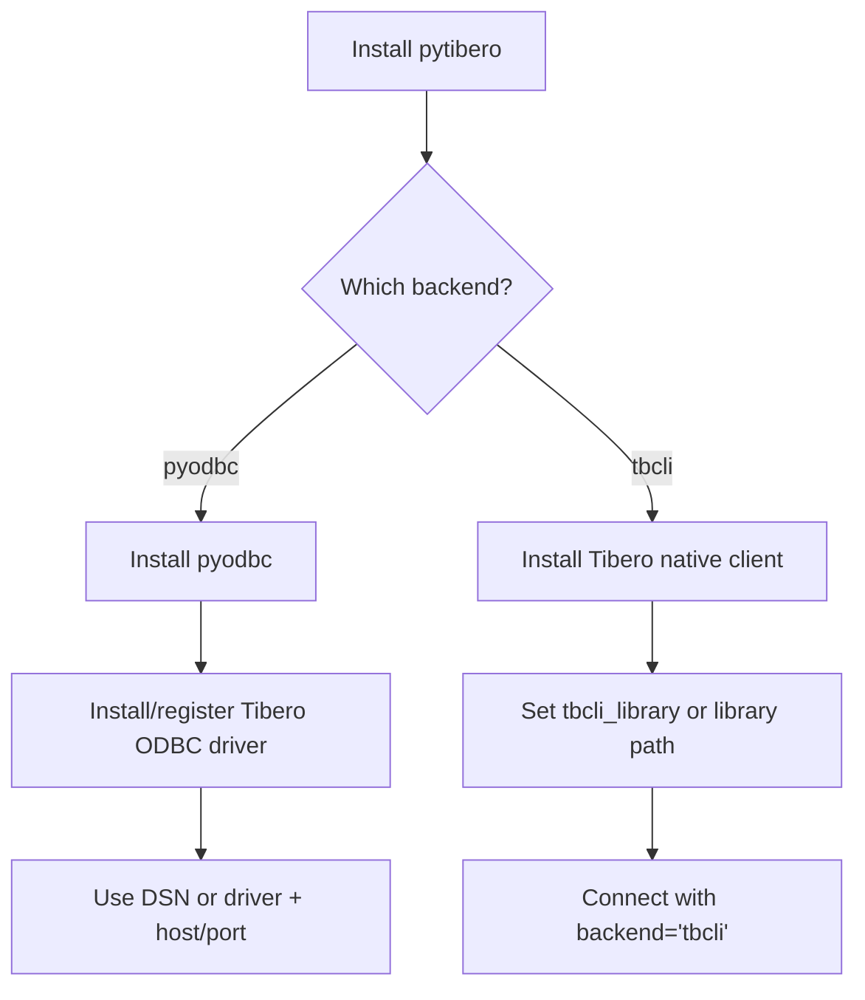

# Installation

!!! note "Backend choice"
    `pyodbc` is the default backend and works well in standard ODBC deployments.
    Use `tbcli` when you need direct native Tibero client connectivity.

## Python package

```bash
pip install pytibero
```

## Development install

```bash
python -m venv .venv
source .venv/bin/activate
pip install -e ".[dev]"
```

## System prerequisites

- Python 3.10 or newer
- unixODBC or another compatible ODBC manager
- `pyodbc`
- A Tibero ODBC driver available to the runtime environment

!!! warning "System dependencies are required"
    Even after installing the Python package, connection still depends on external ODBC or native Tibero client libraries being present and loadable.

## Installation and backend decision flow



## Connection styles

### Direct host and port

```python
import pytibero

conn = pytibero.connect(
    host="localhost",
    port=8629,
    database="test",
    user="tibero",
    password="tmax",
)
```

### DSN

```python
import pytibero

conn = pytibero.connect(dsn="TIBERO_TEST", user="tibero", password="tmax")
```

!!! tip "DSN mode"
    DSN mode delegates endpoint details to your ODBC manager configuration.

### Native tbCLI backend

```python
import pytibero

conn = pytibero.connect(
    host="localhost",
    user="tibero",
    password="tmax",
    backend="tbcli",
    tbcli_library="/opt/tibero7/client/lib/libtbcli.so",
)
```

Use the `tbcli` backend when the Tibero native client library is installed on
the host. If `tbcli_library` is omitted, `pytibero` will try to discover
`libtbcli.so` automatically.

!!! warning "tbcli runtime loading"
    If auto-discovery fails, provide an explicit absolute path via `tbcli_library`.

### Advanced options

```python
import pytibero

conn = pytibero.connect(
    host="localhost",
    user="tibero",
    password="tmax",
    autocommit=True,
    readonly=True,
    ApplicationName="pytibero-app",
)
```

Common `pyodbc.connect(...)` kwargs such as `readonly`, `ansi`, `timeout`,
`attrs_before`, and `unicode_results` are passed through as native connection
arguments. Other extra keyword arguments are appended to the ODBC connection
string.

!!! info "Keyword routing"
    Refer to the [Connection Guide](connection.md) for a complete mapping of kwargs routed to native connect arguments versus ODBC string attributes.
