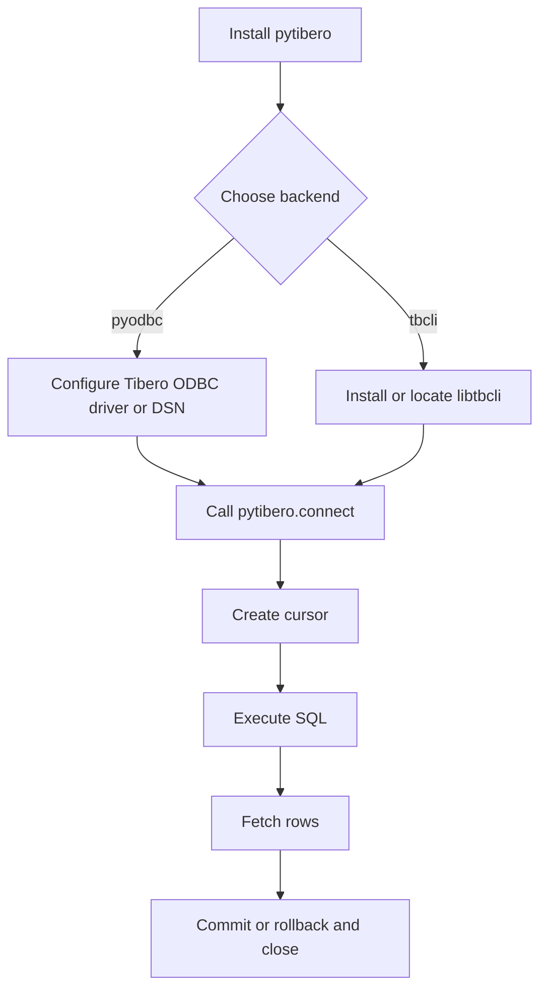

# Quick Start

Connect to Tibero in 5 minutes using `pytibero`.

!!! info "Prerequisites"
    - A reachable Tibero server
    - Python 3.9+
    - One backend path:
      - `pyodbc` + a Tibero ODBC driver, or
      - Tibero native `tbcli` library for the `tbcli` backend

!!! warning "Backend dependencies are external"
    `pip install pytibero` installs the Python package, but system-level ODBC or native Tibero client libraries still must be installed and discoverable.

## 1) Install

```bash
pip install pytibero
```

## 2) Pick a connection mode

### Mode A: Direct driver + host/port (default `pyodbc` backend)

```python
import pytibero

conn = pytibero.connect(
    host="localhost",
    port=8629,
    database="test",
    user="tibero",
    password="tmax",
    driver="Tibero 7 ODBC Driver",
)
```

### Mode B: DSN (`pyodbc` backend)

```python
import pytibero

conn = pytibero.connect(
    dsn="TIBERO_TEST",
    user="tibero",
    password="tmax",
)
```

### Mode C: Native `tbcli` backend

```python
import pytibero

conn = pytibero.connect(
    host="localhost",
    port=8629,
    database="test",
    user="tibero",
    password="tmax",
    backend="tbcli",
    tbcli_library="/opt/tibero7/client/lib/libtbcli.so",  # optional if discoverable
)
```

## 3) Run a query

```python
import pytibero

with pytibero.connect(
    host="localhost",
    port=8629,
    database="test",
    user="tibero",
    password="tmax",
) as conn:
    with conn.cursor() as cur:
        cur.execute("SELECT 1 FROM dual")
        rows = cur.fetchall()
        print(rows)
```

## Quickstart workflow



## Next steps

- [Connection Guide](connection.md)
- [API Reference](api.md)
- [Error Handling](errors.md)
