# Type Mapping

`pytibero` exposes PEP 249 type objects and constructor helpers from `pytibero.types`.

## PEP 249 type objects

These are `DBAPIType` instances.

| Type object | ODBC SQL type codes | Typical meaning |
|---|---|---|
| `STRING` | `{1, 12}` (`SQL_CHAR`, `SQL_VARCHAR`) | Character/text-like SQL values |
| `BINARY` | `{-2, -3, -4}` (`SQL_BINARY`, `SQL_VARBINARY`, `SQL_LONGVARBINARY`) | Binary/blob-like SQL values |
| `NUMBER` | `{-5, 2, 3, 4, 5, 6, 7, 8}` (`SQL_BIGINT`, `SQL_NUMERIC`, `SQL_DECIMAL`, `SQL_INTEGER`, `SQL_SMALLINT`, `SQL_FLOAT`, `SQL_REAL`, `SQL_DOUBLE`) | Numeric SQL values |
| `DATETIME` | `{91, 92, 93}` (`SQL_TYPE_DATE`, `SQL_TYPE_TIME`, `SQL_TYPE_TIMESTAMP`) | Date/time SQL values |
| `ROWID` | `{15}` | Row identifier values |

## Type constructors

| Function | Input | Return |
|---|---|---|
| `Date(year, month, day)` | calendar components | `datetime.date` |
| `Time(hour, minute, second)` | time components | `datetime.time` |
| `Timestamp(year, month, day, hour, minute, second)` | datetime components | `datetime.datetime` |
| `DateFromTicks(ticks)` | Unix timestamp | `datetime.date` |
| `TimeFromTicks(ticks)` | Unix timestamp | `datetime.time` |
| `TimestampFromTicks(ticks)` | Unix timestamp | `datetime.datetime` |
| `Binary(value)` | `bytes \| bytearray \| str` | `bytes` |

`Binary(...)` behavior:

- `bytes` -> returned unchanged
- `bytearray` -> converted with `bytes(...)`
- `str` -> UTF-8 encoded bytes
- other types -> `TypeError`

## SQL type ↔ Python type mapping

The tbcli transport uses SQL type codes to decode fetched values.

| SQL family / code | Python result |
|---|---|
| Integer-like numeric codes (`NUMBER` set, `SQL_SMALLINT`, `SQL_INTEGER`, `SQL_BIGINT`) | `int` when parseable, otherwise `decimal.Decimal` |
| Floating codes (`SQL_FLOAT`, `SQL_REAL`, `SQL_DOUBLE`) | `float` |
| `SQL_TYPE_DATE` | `datetime.date` |
| `SQL_TYPE_TIME` | `datetime.time` |
| `SQL_TYPE_TIMESTAMP` | `datetime.datetime` |
| Binary codes (`SQL_BINARY`, `SQL_VARBINARY`, `SQL_LONGVARBINARY`) | `bytes` |
| `STRING` / `ROWID` families | `str` |

## `DBAPIType` comparison semantics

`DBAPIType.__eq__` supports:

- comparing with `int` type codes (`STRING == 12`)
- comparing with another `DBAPIType` (value-set equality)

`__ne__` negates `__eq__` result.

```python
from pytibero import STRING, NUMBER

assert STRING == 12
assert NUMBER != 12
```

## Type resolution flow

```mermaid
flowchart TD
    A[Raw SQL column type code] --> B{Binary family?}
    B -->|yes| C[Return bytes]
    B -->|no| D{Numeric family?}
    D -->|integer-like| E[Try int, fallback decimal.Decimal]
    D -->|float-like| F[Return float]
    D -->|no| G{Datetime family?}
    G -->|date| H[datetime.date]
    G -->|time| I[datetime.time]
    G -->|timestamp| J[datetime.datetime]
    G -->|no| K[Return str]
```



!!! warning "Common type gotchas"
    - `Binary("text")` encodes as UTF-8 bytes. If byte-level format matters, pass explicit `bytes`.
    - Numeric text may become `decimal.Decimal` when integer parsing fails.
    - DB-API type objects are not Python classes; they are comparison helpers.
